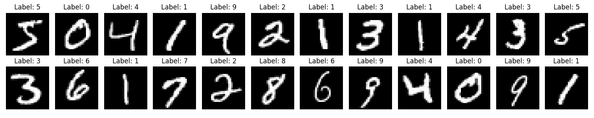

  

<h1 align="center">Redes Neurais Convolucionais (CNN) 📸:</h1>

<h3 align="center">Classificando imagens do dataset MNIST com o módulo Lightning</h3>

<strong>Autores:</strong> Maria Emily Nayla Gomes da Silva e Yasmin Barbosa Shimizu

<strong>Professor:</strong> Daniel R. Cassar

## 📝 Descrição

 O trabalho apresenta a construção de uma Rede Neural Convolucional (CNN) utilizando dados do dataset MNIST, o qual contém inúmeros tensores de imagens em preto e branco, acompanhados de seus respectivos rótulos (labels) representando os dígitos. A partir de um código de referência [adicionar], foram realizadas modificações para torná-lo compatível com a biblioteca Lightning, permitindo a obtenção de um modelo otimizado para a identificação de números manuscritos. Para avaliar a qualidade do modelo, também foi gerada uma matriz de confusão.

## 📔 Notebooks e arquivos do projeto
  
## 🗂️ MNIST - Dataset

O dataset escolhido para desenvolver uma CNN com a biblioteca Lightning foi o MNIST. Esse conjunto de dados apresenta um extenso banco com 60.000 exemplos para treinamento, além de 10.000 exemplos previamente separados para teste. Dessa forma, trata-se de um conjunto vantajoso tanto para o treinamento quanto para a avaliação da performance do modelo treinado. A seguir, apresenta-se uma imagem com 24 exemplos disponíveis, cada um composto por um tensor da imagem e seu respectivo rótulo, que representa o número correspondente.

 

  

## 🏋️‍♀️ Construindo e Treinando a CNN

 -> Biblioteca Lighting

 -> Cross Entropy

## 🔢 Resultados Obtidos

Os resultados obtidos foram excelentes. A baixa variabilidade dos dados, aliada ao grande número de exemplos e ao uso de uma ferramenta otimizada, a biblioteca Lightning, justifica a matriz de confusão apresentada a seguir, bem como a acurácia superior a 98% alcançada com apenas duas épocas. A concentração da densidade de predições na diagonal principal revela a qualidade do modelo, indicando que ele não está sobreajustado, mas sim realizando uma grande quantidade de previsões corretas.

 

  

## 😁 Conclusão

A biblioteca Lightning mostrou-se bastante eficiente para lidar com os dados disponíveis. Especificamente, trabalhamos com um grande volume de dados e com baixa variabilidade entre os exemplos. Ainda assim, apenas duas épocas de treinamento com três filtros foram suficientes para alcançar uma acurácia superior a 98%. Dessa forma, consideramos essa ferramenta bastante poderosa.

## 🖇️ Informações técnicas

## 👩‍🦳 Referências

## 🧠 Contribuições dos Colaboradores
| [  Maria Emily Nayla](https://github.com/MEmilyGomes)  [Currículo Lattes](http://lattes.cnpq.br/9482558334105708)  |  [ Yasmin Shimizu](https://github.com/yasminbshimizu)  [Currículo Lattes](https://github.com/yasminbshimizu)  [Linkedin](https://www.linkedin.com/in/yasmin-bshimz/) | 
| :---: | :---: | 

#### Para o Projeto:
* Emily Gomes: Atualizações na construção, treinamento e análise da previsão de uma CNN utilizando o Lightning.
* Yasmin Shimizu: Atualizações na construção, treinamento e análise da previsão de uma CNN utilizando o Lightning.

#### Para o Repositório GitHub:
* Emily Gomes: README e upload do notebook Jupyter referente a construção, treinamento e previsão da CNN.
* Yasmin Shimizu: README, upload de imagens e upload do notebook Jupyter referente à figura "24Imagens_MNIST.png".
